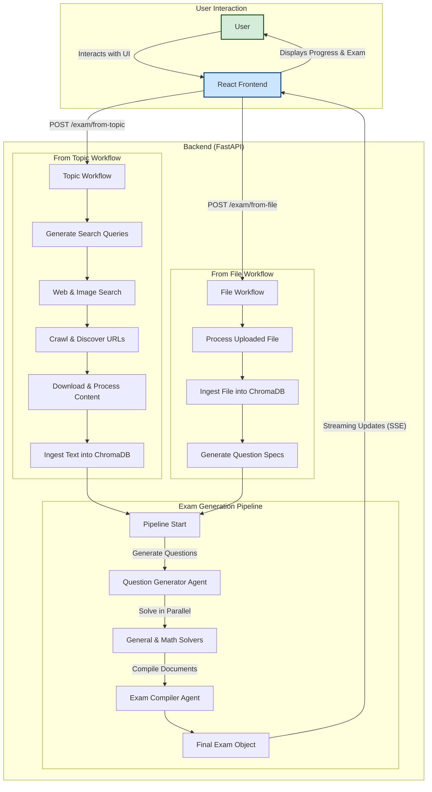

# SmartExam

An advanced, multi-agent autonomous system designed to generate comprehensive and customized exams from high-level topics or user-provided documents. By leveraging a series of specialized AI agents, it automates the entire exam creation lifecycle: from intelligent query generation and web crawling for source material to data processing, question generation, solving, and final compilation into polished exam and answer key documents.

This system goes beyond simple question generation by incorporating a sophisticated Retrieval-Augmented Generation (RAG) pipeline, processing web pages, PDFs, and images to build a rich, multi-modal understanding of the subject matter. The entire process is exposed via a streaming RESTful API and consumed by a modern, responsive frontend.

## Key Features

-   **Dual Generation Modes:**
    -   **From Topic:** Provide a subject and grade level, and the system will search the web for relevant educational materials to build an exam.
    -   **From File:** Upload a source document (e.g., a syllabus, textbook chapter, or lecture notes), and the system will intelligently analyze its content to generate a relevant exam.
-   **Multi-Agent System:** Utilizes a team of specialized AI agents for a robust, divide-and-conquer approach.
-   **Advanced RAG Pipeline:** Processes diverse file types including HTML, PDFs, DOCX, and **images (via OCR)** using the `unstructured.io` library.
-   **Vector-Based Storage & Retrieval:** Embeds and stores processed data chunks in a persistent **ChromaDB** vector store.
-   **Streaming Interface:** The FastAPI backend uses Server-Sent Events (SSE) to stream real-time progress updates to the client.
-   **Modern Tech Stack:** Built with FastAPI for the backend and React/TypeScript for a responsive, dark-mode-enabled frontend.

## Usage

Once the application is running, you can generate an exam by following these steps:

1.  Open your browser and navigate to **[http://localhost:5173](http://localhost:5173)**.
2.  Choose your preferred generation mode:
    -   **From Topic:** To have the AI search the web for source material.
    -   **From File:** To generate an exam based on a document you upload.
3.  Fill out the required fields (e.g., Subject, Grade Level, Title).
4.  Click the "Generate Exam" button.
5.  A real-time progress modal will appear, showing you the current step, status, and a detailed log of the generation process.
6.  Once complete, the final exam paper, answer key, and generation details will be displayed on the screen.

## System Architecture

The application is a monorepo consisting of a Python backend and a React frontend. The backend orchestrates two main workflows: "Generate from Topic" and "Generate from File," both culminating in a unified exam generation pipeline.



## Tech Stack

| Area                      | Technology                                                                                                    |
| ------------------------- | ------------------------------------------------------------------------------------------------------------- |
| **Backend**               | Python 3.11, FastAPI, LangChain (LCEL), Uvicorn                                                               |
| **Package Management**    | `uv` (for both environment and packages)                                                                      |
| **LLMs & Embeddings**     | OpenAI (GPT-4 series, `text-embedding-3-small`), DeepSeek (optional)                                          |
| **Data Ingestion**        | `google-api-python-client` (for Search), `unstructured.io` (for parsing), `aiohttp` (for crawling)              |
| **System Dependencies**   | **Tesseract OCR Engine**                                                                                      |
| **Vector DB**             | ChromaDB (Persistent)                                                                                         |
| **Frontend**              | React 19, TypeScript, Vite                                                                                    |
| **Frontend Styling**      | Tailwind CSS (with Dark Mode)                                                                                 |
| **Frontend Dependencies** | `npm`                                                                                                         |

## Setup and Installation

### Quickstart with Installation Script (Recommended)

For macOS, Linux, and **Windows users with a bash shell (like Git Bash or WSL)**, the provided script automates the entire setup process.

**How it works:** The script is designed to be cross-platform. It robustly detects common tools (like `uv.exe` and `tesseract.exe`) in Windows environments when run from a bash shell, preventing common PATH issues.

1.  **Clone the Repository:**
    ```sh
    git clone https://github.com/Rah-Rah-Mitra/SmartExam.git
    cd SmartExam
    ```

2.  **Make the script executable:**
    ```sh
    chmod +x setup.sh
    ```

3.  **Run the script:**
    ```sh
    ./setup.sh
    ```
    The script will:
    -   ✅ Check for all required dependencies (`python3`, `uv`, `tesseract`, `npm`).
    -   ✅ Set up the `backend`, create the `.env` file, and install Python packages.
    -   ✅ Set up the `frontend`, install npm packages, and update the API endpoint.
    -   ✅ Verify that the required API keys are present in the `backend/.env` file.

After the script finishes, follow the on-screen instructions to run the application.

---

### Manual Installation

If you prefer to set up the project manually or are on an unsupported system, follow these steps.

#### Prerequisites

-   **Python:** Version 3.11.
-   **uv:** A fast Python package installer.
-   **Node.js & npm:** Version 18.x or higher.
-   **Tesseract OCR Engine:** A system-level dependency.

#### Step 1: Install Tesseract OCR Engine

This is a **critical backend dependency** for processing images and scanned PDFs.

-   **On Windows:** Download from [**Tesseract at UB Mannheim**](https://github.com/UB-Mannheim/tesseract/wiki) and ensure you **add it to your system PATH** during installation.
-   **On macOS:** `brew install tesseract`
-   **On Linux (Debian/Ubuntu):** `sudo apt update && sudo apt install tesseract-ocr`

#### Step 2: Configure Backend

1.  Navigate to `cd backend`.
2.  Copy the environment file: `cp .env.example .env`.
3.  Edit `backend/.env` with your secret API keys.
4.  Set up the Python environment:
    ```sh
    uv venv
    source .venv/bin/activate  # Or .venv\Scripts\activate on Windows
    uv pip install -r requirements.txt
    ```

#### Step 3: Configure Frontend

1.  Navigate to `cd ../frontend`.
2.  Install dependencies: `npm install`.
3.  **Important:** Open `frontend/src/constants.ts` and ensure the `API_BASE_URL` is set to `http://127.0.0.1:8000`.

#### Troubleshooting Frontend Dependencies

If you encounter warnings about `deprecated` packages after `npm install`, you can update your dependencies using `npm-check-updates`.

1.  Navigate to the `frontend` directory.
2.  Install the tool globally: `npm install -g npm-check-updates`
3.  Apply updates using `npx` to avoid PATH conflicts: `npx npm-check-updates -u`
4.  Install the new package versions: `npm install`

## How to Run the Application

You need to run the backend and frontend servers in two separate terminals.

### Terminal 1: Start the Backend Server

Make sure you are in the `backend` directory and the virtual environment is activated.

```sh
cd backend
# Activate environment based on your OS
# macOS/Linux/WSL:
source .venv/bin/activate
# Windows (CMD/PowerShell):
# .venv\Scripts\activate

# Start the FastAPI server on port 8000
uvicorn main:app --host 0.0.0.0 --port 8000 --reload
```
Access the API docs at **[http://127.0.0.1:8000/docs](http://127.0.0.1:8000/docs)**.

### Terminal 2: Start the Frontend Server

Make sure you are in the `frontend` directory.

```sh
cd frontend

# Start the Vite development server
npm run dev
```
The application will be available at **[http://localhost:5173](http://localhost:5173)**.

## Project Structure
```
./
├── backend/
│   ├── config/             # Project configuration (settings, logging, presets)
│   ├── logs/               # Log files generated during runtime
│   ├── prompts/            # System prompts for each AI agent
│   ├── src/
│   │   └── deep_searcher/
│   │       ├── agents/     # Logic for individual AI agents (generation, solving)
│   │       ├── chains/     # LCEL chains orchestrating the exam pipeline
│   │       ├── data_pipeline/ # Modules for search, crawling, and content processing
│   │       ├── models/     # Pydantic models for data structures and API schemas
│   │       ├── utils/      # Helper functions (sanitizers, streaming)
│   │       └── vector_store/ # Management of the ChromaDB vector store
│   ├── .env.example        # Example environment file for the backend
│   ├── main.py             # FastAPI application entry point
│   └── requirements.txt    # Python dependencies
│
└── frontend/
    ├── public/             # Static assets
    ├── src/
    │   ├── components/     # Reusable React components (forms, display, progress)
    │   ├── services/       # API service for communicating with the backend
    │   ├── App.tsx         # Main application component and state management
    │   ├── index.css       # Global styles
    │   └── types.ts        # TypeScript type definitions
    ├── index.html          # Main HTML entry point for Vite
    ├── package.json        # Frontend dependencies and scripts
    └── vite.config.ts      # Vite build configuration
```

## License

This project is licensed under the MIT License. See the [LICENSE.txt](LICENSE.txt) file for details.

---

