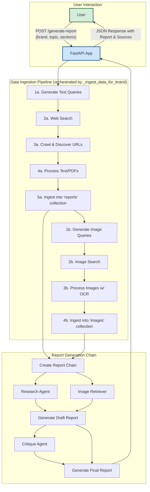

# Deep-Agentic-Analyser

The Deep-Agentic-Analyser is an advanced, multi-agent autonomous research system designed to perform in-depth corporate analysis on any given topic. By leveraging a series of specialized AI agents, it automates the entire research lifecycle: from intelligent query generation and comprehensive web crawling to data processing, synthesis, and the final generation of a structured, well-cited report.

This system goes beyond simple web searches by incorporating both **textual analysis** and **visual analysis**, processing web pages, PDFs, and images to build a rich, multi-modal understanding of the research subject. The final output is a professional report delivered via a clean RESTful API.

## Key Features

-   **Multi-Agent System:** Utilizes a team of specialized AI agents (Query Generator, Research, Report, Critique) for a robust, divide-and-conquer approach.
-   **Advanced Search & Discovery:**
    -   Generates dynamic, context-aware Google search queries using advanced dorking techniques.
    -   Performs both web and image searches to gather diverse data types.
    -   Employs a sophisticated crawling pipeline using **Playwright** and **Crawl4AI** to discover relevant content beyond initial search hits.
-   **Multi-Modal Data Processing:**
    -   Processes HTML, PDFs, and images (`.jpg`, `.png`, `.webp`, etc.).
    -   Uses the powerful **`unstructured.io`** library with model-based strategies (`hi_res`) to partition documents and extract text from images using OCR.
-   **Vector-Based Storage & Retrieval:**
    -   Embeds and stores processed data chunks in a persistent **ChromaDB** vector store.
    -   Maintains separate, organized collections for text documents and images.
-   **Iterative Report Generation:**
    -   A **Research Agent** synthesizes initial findings from the vector store.
    -   A **Report Agent** writes a polished draft, incorporating a relevant image.
    -   A **Critique Agent** reviews the draft and provides actionable feedback.
    -   The **Report Agent** produces a final, revised report based on the critique.
-   **RESTful API:** Exposes its functionality through a clean, well-documented API built with **FastAPI**.

## System Architecture

The application operates in two main phases: the **Data Ingestion Pipeline** and the **Report Generation Chain**. The entire process is orchestrated by the main FastAPI application.



## Tech Stack

-   **Orchestration & Framework:** FastAPI, LangChain (LCEL)
-   **Large Language Models:** OpenAI (`gpt-4.5-preview`)
-   **Data Ingestion & Processing:**
    -   **Search:** Google Custom Search API (`google-api-python-client`)
    -   **Crawling:** Playwright, Crawl4AI
    -   **Document Parsing:** `unstructured[local-inference]`
-   **Vector Storage & Embeddings:**
    -   **Database:** ChromaDB (Persistent)
    -   **Embeddings:** OpenAI (`text-embedding-3-small`)
-   **Package Management:** `uv`

## Setup and Installation Guide

Follow these steps carefully to set up and run the project locally.

### Prerequisites

-   **Python:** Version 3.11 or higher.
-   **uv:** A fast Python package installer. If you don't have it, install it with `pip install uv`.
-   **Git:** For cloning the repository.

### Step 1: Clone the Repository

```sh
git clone https://github.com/Rah-Rah-Mitra/Deep-Agentic-Analyser.git
cd Deep-Agentic-Analyser
```

### Step 2: Install Tesseract OCR Engine

This is a **critical dependency** for the `unstructured` library to process images.

#### For Windows:

1.  Go to the official Tesseract builds for Windows: [**https://github.com/UB-Mannheim/tesseract/wiki**](https://github.com/UB-Mannheim/tesseract/wiki).
2.  Download the recommended 64-bit installer (e.g., `tesseract-ocr-w64-setup-vX.X.X.exe`).
3.  Run the installer. During installation, ensure you check the box for **"Add Tesseract to system PATH"**.
4.  After installation, **open a new terminal** and verify the installation by running:
    ```sh
    tesseract --version
    ```
    You should see the version number printed without any errors.

#### For macOS:

Use Homebrew to install Tesseract:
```sh
brew install tesseract
```

#### For Linux (Debian/Ubuntu):

Use apt to install Tesseract:
```sh
sudo apt update
sudo apt install tesseract-ocr
```

### Step 3: Set Up the Python Environment

This project uses `uv` for fast dependency management.

```sh
# Create a virtual environment
python -m venv .venv

# Activate the virtual environment
# On Windows:
.venv\Scripts\activate
# On macOS/Linux:
source .venv/bin/activate

# Install all required packages using uv
uv pip install -r requirements.txt
```
This will install all necessary libraries, including FastAPI, LangChain, ChromaDB, and the CPU-based inference models for `unstructured`.

### Step 4: Configure Environment Variables

You need to provide API keys for the services used by the application.

1.  **Create a `.env` file** by copying the example file:
    ```sh
    # On Windows
    copy .env.example .env

    # On macOS/Linux
    cp .env.example .env
    ```

2.  **Edit the `.env` file** and add your secret keys:
    ```env
    # .env
    OPENAI_API_KEY="sk-..."
    GOOGLE_API_KEY="AIza..."
    GOOGLE_CSE_ID="..."
    ```

    -   **`OPENAI_API_KEY`**: Your API key from [OpenAI](https://platform.openai.com/api-keys).
    -   **`GOOGLE_API_KEY`**: Your API key from the [Google Cloud Console](https://console.cloud.google.com/apis/credentials). Ensure the "Custom Search API" is enabled for your project.
    -   **`GOOGLE_CSE_ID`**: Your Custom Search Engine ID.
        1.  Go to the [Programmable Search Engine](https://programmablesearchengine.google.com/controlpanel/all) control panel.
        2.  Create a new search engine.
        3.  In the setup options, enable **"Search the entire web"**.
        4.  Copy the "Search engine ID" and paste it here.

## How to Run the Application

With the environment set up and activated, start the API server:

```sh
uv run main.py
```

The server will start, and you can access the API documentation.

-   **Swagger UI (Interactive Docs):** [http://127.0.0.1:1234/docs](http://127.0.0.1:1234/docs)
-   **Redoc (Alternative Docs):** [http://127.0.0.1:1234/redoc](http://127.0.0.1:1234/redoc)

## API Usage

The primary endpoint is `/generate-report`. You can use the Swagger UI to test it or send a `POST` request using a tool like `curl`.

### Example `curl` Request

```sh
curl -X 'POST' \
  'http://127.0.0.1:1234/generate-report?brand=NVIDIA&topic=Analysis%20of%20AI%20chip%20market%20dominance' \
  -H 'accept: application/json' \
  -d ''
```
This will kick off the full research and report generation process. The initial request will take some time to complete as it involves extensive data gathering and processing.

## Project Structure

```
./
├── config/               # Project configuration (settings, logging)
├── logs/                 # Log files generated during runtime
├── prompts/              # System prompts for each AI agent
├── src/
│   └── deep_searcher/
│       ├── agents/       # Logic for individual AI agents
│       ├── chains/       # LangChain Expression Language (LCEL) chains
│       ├── data_pipeline/ # Modules for search, crawling, and processing
│       ├── models/       # Pydantic models for data structures
│       ├── utils/        # Helper functions and utilities
│       └── vector_store/ # Management of the ChromaDB vector store
├── .env.example          # Example environment file
├── main.py               # FastAPI application entry point
└── requirements.txt      # Python dependencies
```